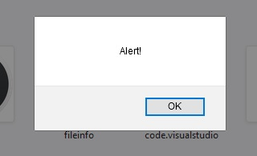

# document.write()

Do wyświetlenia zawartości zmiennej w oknie przeglądarki służy funkcja document.write(). Pomiędzy nawiasami wpisujemy co chcemy wyświetlić, po przecinku możemy podać kolejne argumenty. Jako argument możemy podać zarówno zmienną, jak i wartość nie przypisaną do zmiennej.
```js
let x = 'Java';
document.write(x, 'Script'); // Wyświetli na stronie "JavaScript"
```
# alert()
Wyświetla wyskakujące okienko z treścią podaną jako parametr.

```js
alert('Alert!');
```


# console.log()